# Life Hacks

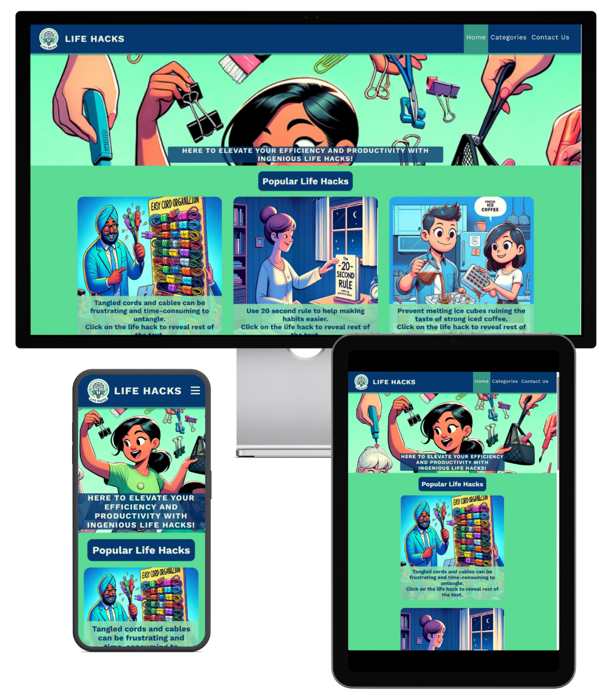

The deployed site: [Life Hacks](https://redifo.github.io/ci_pp1/)

## CONTENTS

* [User Experience](#user-experience-ux)
  * [User Stories](#user-stories)

* [Design](#design)
  * [Colour Scheme](#colour-scheme)
  * [Typography](#typography)
  * [Imagery](#imagery)
  * [Wireframes](#wireframes)
  * [Features](#features)
    * [The Home Page](#the-home-page)
    * [The Categories Page](#the-game-page)
    * [The Contact Page](#future-implementations)
  * [Accessibility](#accessibility)

* [Technologies Used](#technologies-used)
  * [Languages Used](#languages-used)
  * [Frameworks, Libraries & Programs Used](#frameworks-libraries--programs-used)

* [Deployment & Local Development](#deployment--local-development)
  * [Deployment](#deployment)
  * [Local Development](#local-development)

* [Testing](#testing)
  * [Bugs](#Bugs)
  
* [Credits](#credits)
  * [Code Used](#code-used)
  * [Content](#content)
  * [Media](#media)
  * [Acknowledgments](#acknowledgments)

- - -

## User Experience (UX)

### User Stories

#### First Time Visitor Goals
Discover Engaging Life Hacks:

Upon landing on the homepage, the visitor should be captivated by the hero section's message and image, encouraging them to explore ingenious life hacks. 

Easy Navigation:

The navigation menu should be straightforward, with clear labels like "Home," "Categories," and "Contact Us." This helps first-time visitors easily understand and access key sections of the website.

#### Returning Visitor Goals
Explore More Life Hacks:

Returning visitors might want to discover additional life hacks. The "Popular Life Hacks" section should be prominently displayed, providing a quick overview of trending hacks. (although the webpage is static at the moment).

Efficient Navigation:

Ensure that the navigation menu remains consistent, allowing users to quickly jump to different sections.  

#### Frequent Visitor Goals
Stay Updated with Newsletter:

Frequent visitors interested in receiving regular updates should find the newsletter subscription form easily accessible in the footer. The form should be inviting, and the submission process seamless.

Connect on Social Media:

Include social media icons in the footer, encouraging frequent visitors to connect on platforms like Facebook, Instagram, YouTube, and LinkedIn. This helps in building a community around the website.
- - -

## Design

### Colour Scheme
#05386f (Dark Blue):

This deep, dark blue serves as the background color of navigatio bar and headings. It conveys a sense of trust, professionalism, and stability.

#5cdb95 (Mint Green):

Mint green is used as the background color of the pages main sections to add a refreshing and lively touch to the color scheme. It complements the dark blue, creating a visually pleasing contrast.

#379683 (Teal Green), #edf5e1 (Light Beige), #8ee4af (Celadon Green): were used as accent colors to createa a harmonous switch between colours where necessary. Such as shodows or footer.

Overall, the color scheme has been chosen to create a harmonious and visually appealing environment for users. The combination of dark and light tones, along with carefully selected accent colors, aims to enhance the website's aesthetic appeal, readability, and the overall user experience. The balance of these colors reflects the website's theme of simplicity, practicality, and a positive lifestyle.

  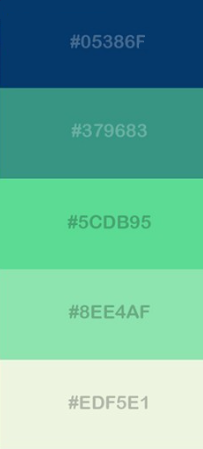

### Typography

Google Fonts was used to import the chosen fonts for use in the site.

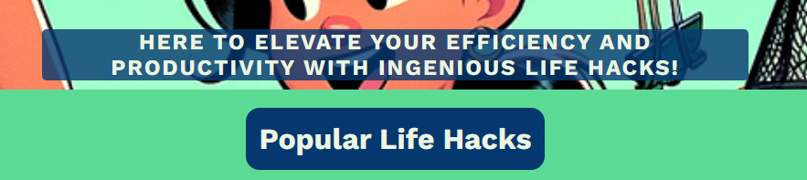

* For the body of the page I have used the google font Work sans. Work Sans provides a modern and clean aesthetic with its sans-serif style. Sans-serif fonts are often chosen for their contemporary look and improved readability on digital screens. 

* For the long texts on life hack boxes i have used Merriweather (Serif). It has small lines or strokes at the ends of characters which aid in guiding the reader's eye along the text.

### Imagery

The imagery was designed to blend into the color scheme by Dall-e 3 using the following prompts:

* For life hack box images: (life hack text same as used in the website) + cartoon illustration of the Life Hack given above use a background color of  #05386f double check the backgroud color.

### Wireframes

Wireframes were created for mobile using balsamiq. For other devices wireframes were not seen as a necessity.

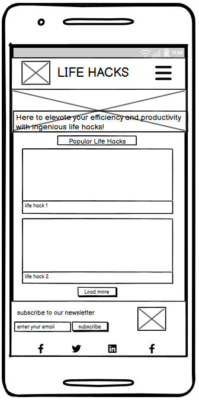
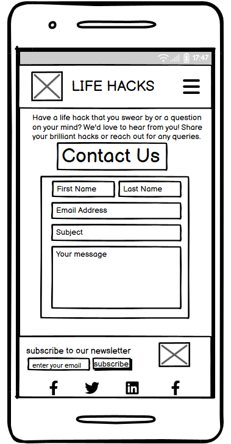

### Features

The website is comprised of a home page, categories page and a contact us page.

All Pages on the website are responsive and include:

* A favicon in the browser tab.

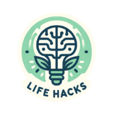

* The title and logo of the website at the top of every page. Both the title and the logo  also acts as a link back to the home page.

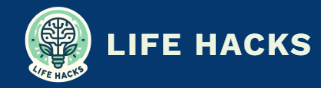

* The navigation bar appears at the top of every page and highlights the current active page with a different background colour. On mobile devices with a screen width less than 768 px the menu items are hidden with a burger (3 horizontal lines)fav icon whe clicked it reveals the meu items (pages). On devices with a mouse hovering on a menu item (pages) changes background color to provide feedback to users, indicating interactivity.

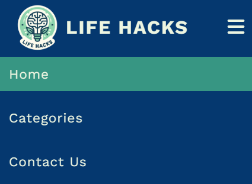
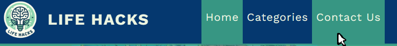

* The footer appears at the bottom of every page and has a subscribe to newsletter form. The input field and button has hover mouse state actions. Input field is highlighted with a box shadow ad button font changes color.
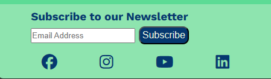
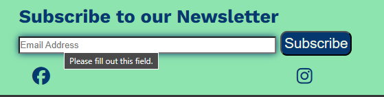

#### The Home Page

The home page  has a hero image and a container which holds a welcome text, below the hero image the main section heading lies. And below the heading life hack boxes appear. upon clicking on the life hack boxes the remainder of the text for that life hack appears.

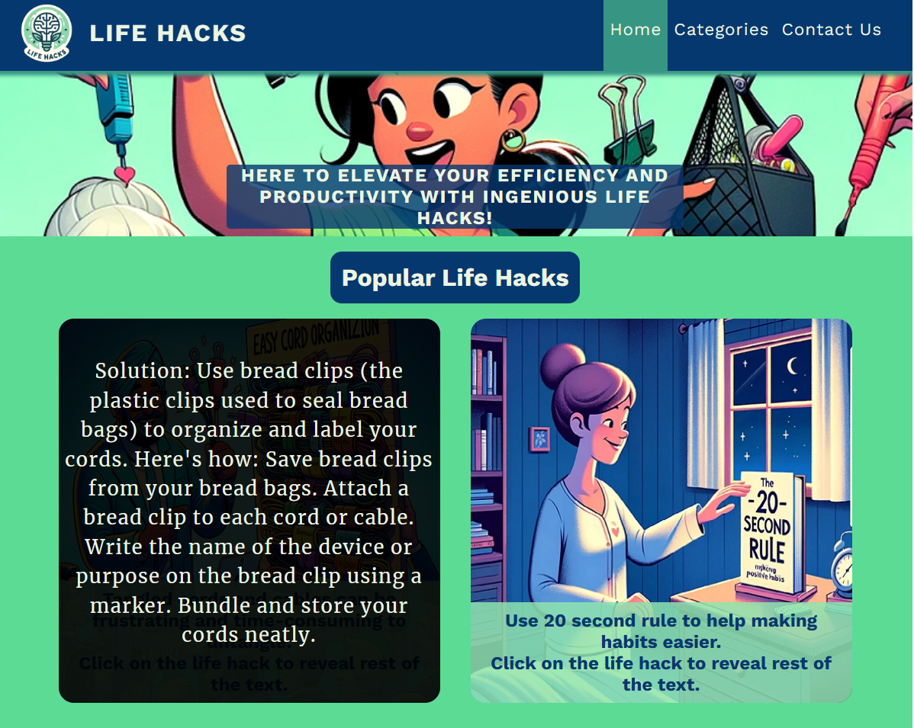

#### The Categories Page
The categories page currently has 3 sections and 3 buttons have been put with these sections names on top of the page. Uopn clciking these the page scrolls/goes to that section. different backgorund colors are used  for each section to better seperate the sections.

#### The Contact Us Page

The contact us page has a main header and a simple contact form.

#### Future Implementations

In future implementations I would like to:

1. Add a load more and load less button for adjusting the amount of life hacks displayed on any page. Currently the amount of life hacks in the website does not require such an implementatiton.
2. incorporating a "Recent Hacks" or "Featured Hacks" section on the homepage to showcase new content.

### Accessibility

I have been mindful during coding to ensure that the website is as accessible friendly as possible. This has been have achieved by:

* Giving all buttons a hover state to enhance the user experience by making the navigation elements responsive, ensuring that users are aware of clickable elements and encouraging engagement with the website's content.
* Choosing a sans serif font for the website - sans serif fonts are known by their easy readibility.
* Making sure that there is sufficient colour contrast.

- - -

## Technologies Used

### Languages Used

HTML, CSS, js

### Frameworks, Libraries & Programs Used

* [Balsamiq](https://balsamiq.com/) - Used to create wireframes.

* [Bing.com Dall-e](https://www.bing.com/images/create/?ref=hn) - Used to create all the images within the website.

* [Git](https://git-scm.com/) - For version control.

* [Github](https://github.com/) - To save and store the files for the website.

* [Google Fonts](https://fonts.google.com/) - To import the fonts used on the website.

* [Google Developer Tools](https://developers.google.com/web/tools) - To troubleshoot and test features, solve issues with responsiveness and styling.

* [Favicon.io](https://favicon.io/) To create favicon from the logo created by Dall-e 3.

* [Canva.com](https://www.canva.com/) To create a mockup of the website imaage on different platforms/devices.
  
* [convertio.co](https://convertio.co) To covert images into webp format.

* [redketchup.io](https://redketchup.io/bulk-image-resizer) To resize the images into same size.

* [Webpage Spell-Check](https://chrome.google.com/webstore/detail/webpage-spell-check/mgdhaoimpabdhmacaclbbjddhngchjik/related) - a google chrome extension that allows you to spell check your webpage. Used to check the site and the readme for spelling errors.

- - -

## Deployment & Local Development

The site is deployed using GitHub Pages: https://redifo.github.io/ci_pp1/

To Deploy the site using GitHub Pages follow these steps:

1. Log in or sign up on GitHub.
2. Navigate to the project repository at [redifo/ci_pp1](https://github.com/redifo/ci_pp1)
3. Click on the "Settings" button.
4. Choose "Pages" from the left-hand menu.
5. In the source dropdown, select the main branch and click "Save."
6. Your site is now deployed, but please note that it might take a few minutes before it becomes live.

### Local Development

#### How to Fork

To fork the repository:

1. Log in or sign up on GitHub.
2. Visit the project repository at  [redifo/ci_pp1](https://github.com/redifo/ci_pp1)
3. Click the "Fork" button in the top right corner.

#### How to Clone

To clone the repository:

1. Log in or sign up on GitHub.
2. Go to the project repository at [redifo/ci_pp1](https://github.com/redifo/ci_pp1)
3. Click on the "Code" button, choose whether to clone with HTTPS, SSH, or GitHub CLI, and copy the provided link.
4. Open the terminal in your code editor, navigate to the desired location for the cloned directory.
5. Type 'git clone' in the terminal and paste the link from step 3. Press enter.

## Testing

Please refer to [TESTING.md](TESTING.md) file for all testing carried out.

### Bugs 

During development the click to reveal function was tried to be implemented using only css. the chekbox method was tried to be used but the label for the checkbox needed to be a div ad that caused errors in the html validator. also the code was sometimes working for some boxes but not for all boxes, therefore javascript was used to implement that method. other small issues was faced during development but nothing important that can be mentioned within this bugs title.

## Credits

### Code Used

* The clicking to reveal hidden text js function were written through the help of these 2 sources. https://stackoverflow.com/questions/61016963/how-do-i-toggle-a-class-on-and-off-whenever-i-click-on-a-list-item 
https://www.youtube.com/watch?v=jBIoUWLghnY

* The redirect of success page code recovered from: https://stackoverflow.com/questions/3292038/redirect-website-after-specified-amount-of-time

### Content

All content for the site,  were written by me and chatGPT (3.5). 
All the life hacks were initially written by chatGPT and edited by me later on.

Readme.md and Testing.md write structure was written by using this past project as a referance: https://github.com/kera-cudmore/TheQuizArms

### Media
All the images were generated by using Dall-e 3.

### Acknowledgments

I would like to acknowledge the following people:
*

* 
