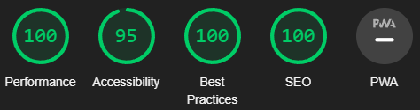
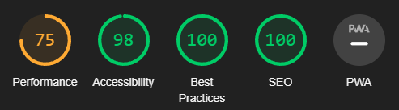

# Life Hacks -  Testing

Deployed website: [Life Hacks](https://redifo.github.io/ci_pp1/)

- - -

## CONTENTS

* [AUTOMATED TESTING](#automated-testing)
  * [W3C Validator](#w3c-validator)
  * [Lighthouse](#lighthouse)
* [MANUAL TESTING](#manual-testing)
  * [Testing User Stories](#testing-user-stories)
  * [Full Testing](#full-testing)

Continuously test throughout construction. Use Chrome developer tools to find and fix issues as you build. Be proactive in addressing challenges.

During development, rely on Google developer tools. Verify components are working. Use the console to check JavaScript and fix issues.

Check each page for responsiveness. Use Chrome and Firefox tools. Ensure a seamless user experience on various devices. Adapt to the multi-device landscape.
- - -

## AUTOMATED TESTING

### W3C Validator

The w3 html and jigsaw css validator has been used to make sure the code does not contain any errors. the results shown below are the results of the final tests. During the development of the code this validator has been used multiple times but the results were not recorded before the final testings.

* [W3C](https://validator.w3.org/) 

* [index.html](testing/img/backslash-error.png) - 
* [categories.html](testing/img/no-errors.png) -  
* [contact.html](testing/img/no-errors.png) - 
* [success.html](testing/img/successpage-errors.png) - 

* [style.css](testing/img/jigsaw-css-no-error.png) - 

- - -

### Lighthouse

The website has been tested by google chrome's lighthouse report and the results are shown below. 

### Desktop Results

All pages of the site are achieving a score of 100 across the 4 categories.

### Mobile Results

Performance ratings are a bit low on some pages on mobile but achieving 100% on that metric is very hard without using very low quality photos.

- - -

## MANUAL TESTING

### Testing User Stories

`First Time Visitors`

| Goals | How are they achieved? |
| :--- | :--- |
|  |
|  |  |
| |   |

`Returning Visitors`

|  Goals | How are they achieved? |
| :--- | :--- |
|  |  |

`Frequent Visitors`

| Goals | How are they achieved? |
| :--- | :--- |
|  |  |
|  |

- - -

### Full Testing

Full testing was performed on the following devices:

Each device tested the site using the following browsers:

* Google Chrome
* Microsoft Edge

`Home page`

| Feature | Expected Outcome | Testing Performed | Result | Pass/Fail |
| --- | --- | --- | --- | --- |
| The Sites title | Link directs the user back to the home page | Clicked title | direct to home page |  |
| All buttons - hover effect | Change colour when hovered on | Hover over each button on the page | Each button displayed the correct styling when hovered over |  |
|  | | |  |  |

|  | |  | |  |

`Categories Page`

| Feature | Expected Outcome | Testing Performed | Result | Pass/Fail |
| --- | --- | --- | --- | --- |
| The Sites title | Link directs the user back to the home page | Clicked title | direct to home page |  |
| All buttons - hover effect | Change colour when hovered on | Hover over each button on the page | Each button displayed the correct styling when hovered over |  |
|  | | |  |  |

|  | |  | |  |

`Contatcs Page`

| Feature | Expected Outcome | Testing Performed | Result | Pass/Fail |
| --- | --- | --- | --- | --- |
| The Sites title | Link directs the user back to the home page | Clicked title | direct to home page |  |
| All buttons - hover effect | Change colour when hovered on | Hover over each button on the page | Each button displayed the correct styling when hovered over |  |
|  | | |  |  |

|  | |  | |  |

`Form Success Page`

| Feature | Expected Outcome | Testing Performed | Result | Pass/Fail |
| --- | --- | --- | --- | --- |
| The Sites title | Link directs the user back to the home page | Clicked title | direct to home page |  |

|  | | |  |  |

|  | |  | |  |

